<div align="center">

# 🛡️ PROJECT AEGIS

### Autonomous Exploit Generation & Intelligence System

**Version 2.0.9** — *"The Realistic Deterministic Standard"*

<br>

[](https://github.com)
[](https://polyformproject.org/licenses/noncommercial/1.0.0/)
[](https://python.org)
[](https://github.com)
[](https://github.com)
[](https://github.com)

<br>

> **"If it cannot be proven, it will not be done."**
> 
> *— The Revised Iron Rule (v2.0.9)*

<br>

[📖 Documentation](#-executive-summary) •
[🚀 Quick Start](#-installation--usage) •
[🏗️ Architecture](#️-technical-architecture) •
[📂 Roadmap](#-project-roadmap) •
[⚖️ License](#️-license--legal)

</div>

---

<br>

## ⚠️ Safety & Non-Proliferation Notice

<table>
<tr>
<td>

### 🔒 THIS REPOSITORY OPERATES IN SIMULATION MODE

In compliance with **dual-use technology standards** and **responsible disclosure practices**, this repository contains the **Cognitive Core** and **Formal Verification Logic** of AEGIS.

| Component | Status |
|:----------|:-------|
| Active Network Drivers | 🚫 **Removed** |
| Exploit Payloads | 🔄 **Replaced with synthetic constraints** |
| Socket Operations | ✅ **Routed through High-Fidelity Simulation Driver** |

</td>
</tr>
</table>

> [!IMPORTANT]
> This codebase allows researchers to audit the *reasoning engine* and *governance logic* without possessing a functional autonomous weapon.

<br>

---

<br>

## 📖 Executive Summary

**PROJECT AEGIS** is a formal-logic-based autonomous cybersecurity framework designed to identify, verify, and remediate vulnerabilities in complex networked systems. Unlike "black box" neural network approaches, AEGIS utilizes **Strict XAI (Explainable AI)** and **SMT Solvers (Z3)** to derive attack paths with mathematical certainty.

The system addresses the **"Kobayashi Maru" state-explosion problem** in binary analysis by utilizing **Targeted Backward Slicing** rather than whole-program symbolic execution.

<br>

### ✨ Core Capabilities (v2.0.9)

<table>
<tr>
<td width="50%">

#### 🧠 Deterministic Reasoning
Uses **Z3 Theorem Prover** to model attack graphs as constraint satisfaction problems with mathematical certainty.

</td>
<td width="50%">

#### ⚖️ O-SAFE Governance
Integrated safety protocol that classifies actions into Tiers (**GREEN/YELLOW/RED**). High-risk actions require cryptographic proof of authorization.

</td>
</tr>
<tr>
<td width="50%">

#### 🔬 JIT Verification
Handles network uncertainty (jitter, packet loss) by treating scan data as `UncertainBool` types until verified by micro-probes.

</td>
<td width="50%">

#### 🔎 Backward Program Slicing
Extracts minimal executable slices from binaries to isolate vulnerability sinks (e.g., `strcpy`, `system`) for analysis.

</td>
</tr>
</table>

<br>

---

<br>

## 🏗️ Technical Architecture

AEGIS is built on a **decoupled architecture** separating the **Logic (Brain)** from the **Execution (Hands)**.

```mermaid
graph TD
    A[👤 User/Operator] -->|Scope Certificate| B(🛡️ Governance Layer / O-SAFE)
    B --> C{⚙️ Decision Engine}
    C -->|Z3 Constraints| D[📐 Universal Grammar Engine]
    
    subgraph AEGIS_Core ["🔓 AEGIS Core (Public)"]
        D --> E[🖥️ Hardware Abstraction Layer]
    end
    
    subgraph Driver_Layer ["🔌 Driver Layer"]
        E --> F[🎮 Simulation Driver]
        E -.-> G[🌐 Real Network Driver]
    end
    
    F -->|Mock Data| H[(💾 Virtual Topology)]
    G -.->|Raw Packets| I[🌍 Real Network]
    
    style AEGIS_Core fill:#1a1a2e,stroke:#16213e,stroke-width:2px
    style Driver_Layer fill:#0f3460,stroke:#16213e,stroke-width:2px
    style A fill:#e94560,stroke:#0f3460,stroke-width:2px
    style B fill:#533483,stroke:#0f3460,stroke-width:2px
    style C fill:#0f3460,stroke:#16213e,stroke-width:2px
```



<br>

### 🔄 The "Dual-Driver" Model

To ensure safety, this public release implements the `AegisDriver` interface using **Simulation-Only** logic.

| Module | Description |
|:-------|:------------|
| `aegis.core` | Contains the full logic, grammar, and solvers |
| `aegis.drivers.simulation` | Provides a deterministic, safe environment for testing the logic against complex topology graphs |

<br>

---

<br>

## 🚀 Installation & Usage

### 📋 Prerequisites

| Requirement | Version | Purpose |
|:------------|:--------|:--------|
|  | `3.11+` | Core runtime |
|  | `latest` | SMT solving |
|  | `latest` | Visualization |

<br>

### ⚡ Quick Setup

```bash
# 1. Clone the repository
git clone https://github.com/sirkianmj/aegis-core.git
cd aegis-core

# 2. Create the environment
conda env create -f environment.yml
conda activate aegis-core

# 3. Verify Safety Checks
pytest tests/test_safety_compliance.py
```

<br>

### 🎮 Running the Simulation

Execute the core logic against a predefined simulation topology:

```bash
python main.py --mode simulation --topology scenarios/corporate_network.json
```

<br>

<details>
<summary><b>📺 Expected Output</b> (click to expand)</summary>

```
[*] AEGIS Core v2.0.9 Initialized
[*] Mode: SIMULATION (Safe)
[+] Loading Grammar... OK (50 rules)
[+] Verifying Scope Certificate... VALID
[!] Analyzing Target: 192.168.1.50
    -> Fact: Port 80 OPEN (Confidence: 1.0)
    -> Constraint: Apache < 2.4.49
    -> Derivation: Path found via CVE-2021-41773
[O-SAFE] Action Tier: RED (Exploitation). Requires Twin-Test.
[SIMULATION] Twin-Test passed. Simulating payload delivery...
[+] Objective Complete. Proof generated.
```

</details>

<br>

---

<br>

## 📂 Project Roadmap

```
┌─────────────────────────────────────────────────────────────────────────────┐
│                              AEGIS DEVELOPMENT ROADMAP                       │
└─────────────────────────────────────────────────────────────────────────────┘
```

| Phase | Sprint | Milestone | Status |
|:-----:|:------:|:----------|:------:|
| 🟢 | **0-4** | Foundation, Grammar Definition (UGE), and Z3 Integration | ✅ Complete |
| 🟡 | **5-10** | Just-In-Time (JIT) Verification and Safety Tiers | ✅ Complete |
| 🟠 | **11-16** | Hardware-Assisted Tracing (HATL) Abstraction | ✅ Complete |
| 🔵 | **21** | Formal Verification of Governance Logic (Coq/Lean) | ✅ Complete |

<br>

---

<br>

## ⚖️ License & Legal

<table>
<tr>
<td>

### 📜 PolyForm Noncommercial License 1.0.0

<br>

#### ✅ You MAY:

- 👁️ View and read the source code
- 🎮 Run the simulation for educational purposes
- 🔍 Audit the governance logic

<br>

#### ❌ You may NOT:

- 💼 Use this software for commercial penetration testing
- 💰 Sell this software or provide it as a service
- ⚔️ Modify the driver layer to weaponize the public release

</td>
</tr>
</table>

<br>

---

<br>

<div align="center">

### 📬 Contact & Support

[](https://github.com/sirkianmj/aegis-core/issues)
[](https://github.com/sirkianmj/aegis-core/discussions)

<br>

---

<br>

**Copyright © 2025 Kian Mansouri Jamshidi / ForgeX4 Research Laboratory**

<sub>Made with 🛡️ for the security research community</sub>

<br>

⬆️ [Back to Top](#️-project-aegis)

</div>
