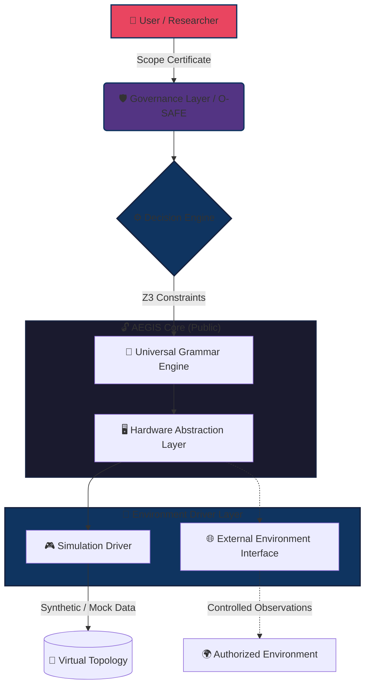

<div align="center">

# 🛡️ PROJECT AEGIS

### Autonomous Exploit Generation & Intelligence System

**Version 2.0.9** — *"The Realistic Deterministic Standard"*

<br>

[](https://github.com)
[](https://polyformproject.org/licenses/noncommercial/1.0.0/)
[](https://python.org)
[](https://github.com)
[](https://github.com)
[](https://github.com)

<br>

> **"If it cannot be proven, it will not be done."**
>
> *— The Revised Iron Rule (v2.0.9)*

<br>

[📖 Documentation](#-executive-summary) •
[🚀 Quick Start](#-installation--usage) •
[🏗️ Architecture](#️-technical-architecture) •
[📂 Roadmap](#-project-roadmap) •
[⚖️ License](#️-license--legal)

</div>

---

<br>

## ⚠️ Research Scope & Safety Notice

<table>
<tr>
<td>

### 🔒 PUBLIC RELEASE: CONTROLLED SIMULATION MODE

AEGIS is an experimental cybersecurity research framework for studying **formal reasoning, vulnerability analysis, automated security validation, and governed decision-making**.

The public release contains the **Cognitive Core** and **Formal Verification Logic** while keeping operational network execution outside the distributed simulation environment.

| Component                       | Public Release                                        |
| :------------------------------ | :---------------------------------------------------- |
| Active Network Drivers          | 🚫 **Not included**                                   |
| Operational Exploit Payloads    | 🚫 **Not included**                                   |
| Exploit Demonstrations          | 🔄 **Represented through synthetic constraints**      |
| Socket Operations               | 🧪 **Routed through High-Fidelity Simulation Driver** |
| Governance & Verification Logic | ✅ **Included for research and audit**                 |

</td>
</tr>
</table>

> [!IMPORTANT]
> This repository is intended for **authorized, controlled, and reproducible security research**. The public implementation allows researchers to study the reasoning, verification, and governance layers of AEGIS without providing an operational network exploitation framework.

> [!NOTE]
> All demonstrations and evaluations should be conducted against deliberately vulnerable, simulated, or explicitly authorized environments. The project does not authorize access to systems, networks, or data without permission.

<br>

---

<br>

## 📖 Executive Summary

**PROJECT AEGIS** is a formal-logic-based autonomous cybersecurity research framework designed to **identify, reason about, verify, and assist in the validation of vulnerabilities within controlled environments**.

Rather than relying exclusively on opaque statistical models, AEGIS combines **Explainable AI (XAI)**, symbolic reasoning, constraint solving, and formal verification techniques to produce **auditable derivations and machine-checkable security decisions**.

The system investigates how deterministic reasoning can be applied to complex cybersecurity analysis while maintaining explicit safety, authorization, and governance constraints.

A central research problem addressed by AEGIS is the computational complexity associated with large program and attack-state spaces. The framework therefore explores **Targeted Backward Slicing** and constrained symbolic analysis as alternatives to unrestricted whole-program exploration.

<br>

### ✨ Core Capabilities (v2.0.9)

<table>
<tr>
<td width="50%">

#### 🧠 Deterministic Reasoning

Uses the **Z3 SMT Solver** to represent security conditions and analysis paths as formally constrained problems, enabling reproducible and auditable reasoning over complex security states.

</td>
<td width="50%">

#### ⚖️ O-SAFE Governance

Integrated governance layer that classifies proposed actions into **GREEN / YELLOW / RED** safety tiers.

Higher-risk operations require explicit authorization evidence and additional verification before they can be considered by the system.

</td>
</tr>
<tr>
<td width="50%">

#### 🔬 JIT Verification

Handles network uncertainty such as jitter and packet loss by representing observations as `UncertainBool` states until they can be validated through controlled verification procedures.

</td>
<td width="50%">

#### 🔎 Backward Program Slicing

Extracts minimal executable slices from binaries to isolate security-relevant program paths and potential vulnerability sinks such as `strcpy` and `system` for controlled analysis.

</td>
</tr>
</table>

<br>

---

<br>

## 🏗️ Technical Architecture

AEGIS uses a **decoupled architecture** that separates the **reasoning and verification layers** from the environment-specific execution layer.

This separation allows the research components to be evaluated independently while keeping the public distribution centered on controlled simulation.


```mermaid
graph TD
    A[👤 User / Researcher] -->|Scope Certificate| B(🛡️ Governance Layer / O-SAFE)
    B --> C{⚙️ Decision Engine}
    C -->|Z3 Constraints| D[📐 Universal Grammar Engine]

    subgraph AEGIS_Core ["🔓 AEGIS Core (Public)"]
        D --> E[🖥️ Hardware Abstraction Layer]
    end

    subgraph Driver_Layer ["🔌 Environment Driver Layer"]
        E --> F[🎮 Simulation Driver]
        E -.-> G[🌐 External Environment Interface]
    end

    F -->|Synthetic / Mock Data| H[(💾 Virtual Topology)]
    G -.->|Controlled Observations| I[🌍 Authorized Environment]

    style AEGIS_Core fill:#1a1a2e,stroke:#16213e,stroke-width:2px
    style Driver_Layer fill:#0f3460,stroke:#16213e,stroke-width:2px
    style A fill:#e94560,stroke:#0f3460,stroke-width:2px
    style B fill:#533483,stroke:#0f3460,stroke-width:2px
    style C fill:#0f3460,stroke:#16213e,stroke-width:2px
```

<br>

### 🔄 The Dual-Driver Model

To support reproducible and safety-conscious experimentation, the public release implements the `AegisDriver` interface through **simulation-first logic**.

| Module                     | Description                                                                                                    |
| :------------------------- | :------------------------------------------------------------------------------------------------------------- |
| `aegis.core`               | Contains the reasoning logic, grammar, governance mechanisms, and solver integration                           |
| `aegis.drivers.simulation` | Provides a deterministic environment for testing reasoning and verification against controlled topology graphs |

The driver abstraction allows the research architecture to remain independent from environment-specific execution mechanisms.

<br>

---

<br>

## 🧩 Research Architecture

The AEGIS architecture is organized around four principal research layers:

### 1. Observation

Collects and represents security-relevant observations while explicitly accounting for uncertainty and incomplete information.

### 2. Reasoning

Transforms observations into formally constrained hypotheses, relationships, and candidate security paths.

### 3. Verification

Applies symbolic reasoning, SMT solving, targeted program analysis, and additional validation procedures to evaluate derived hypotheses.

### 4. Governance

Applies authorization, safety, and policy constraints before a proposed operation can progress through the system.

This separation is intended to make the reasoning process **traceable, reproducible, and independently auditable**.

<br>

---

<br>

## 🔬 Research Principles

AEGIS is built around several research principles:

| Principle                      | Description                                                                                             |
| :----------------------------- | :------------------------------------------------------------------------------------------------------ |
| **Deterministic Reasoning**    | Prefer explicit constraints and reproducible derivations where applicable                               |
| **Explainability**             | Preserve intermediate reasoning states rather than relying exclusively on opaque predictions            |
| **Formal Verification**        | Use machine-checkable methods to validate critical security and governance properties                   |
| **Controlled Experimentation** | Evaluate security behavior in simulated or explicitly authorized environments                           |
| **Governance by Design**       | Treat authorization and safety constraints as architectural components rather than external assumptions |
| **Reproducibility**            | Prefer deterministic test environments and auditable experimental procedures                            |

<br>

---

<br>

## 🚀 Installation & Usage

### 📋 Prerequisites

| Requirement                                                                                     | Version  | Purpose       |
| :---------------------------------------------------------------------------------------------- | :------- | :------------ |
|           | `3.11+`  | Core runtime  |
|             | `latest` | SMT solving   |
|  | `latest` | Visualization |

<br>

### ⚡ Quick Setup

```bash
# 1. Clone the repository
git clone https://github.com/sirkianmj/aegis-core.git
cd aegis-core

# 2. Create the environment
conda env create -f environment.yml
conda activate aegis-core

# 3. Verify safety and governance tests
pytest tests/test_safety_compliance.py
```

<br>

### 🎮 Running the Simulation

Execute the core reasoning engine against a predefined simulation topology:

```bash
python main.py --mode simulation --topology scenarios/corporate_network.json
```

<br>

<details>
<summary><b>📺 Expected Output</b> (click to expand)</summary>

```text
[*] AEGIS Core v2.0.9 Initialized
[*] Mode: SIMULATION
[+] Loading Grammar... OK (50 rules)
[+] Verifying Scope Certificate... VALID
[!] Analyzing Simulated Target: 192.168.1.50
    -> Fact: Port 80 OPEN (Confidence: 1.0)
    -> Constraint: Apache < 2.4.49
    -> Derivation: Candidate security path identified
[O-SAFE] Action Tier: RED (High-Risk Operation)
[SIMULATION] Controlled validation completed.
[+] Objective Analysis Complete. Verification proof generated.
```

</details>

> [!NOTE]
> The example above represents a **synthetic simulation scenario**. The target address and observed conditions are part of the predefined test environment and should not be interpreted as authorization to interact with real systems.

<br>

---

<br>

## 📊 Verification & Governance

A central research objective of AEGIS is to make autonomous cybersecurity reasoning **auditable rather than opaque**.

The O-SAFE governance layer therefore evaluates proposed operations according to:

1. **Scope**
2. **Authorization**
3. **Risk classification**
4. **Verification requirements**
5. **Execution constraints**
6. **Auditability**

Higher-risk operations are prevented from progressing through the public simulation environment without satisfying the applicable governance conditions.

This architecture allows security reasoning to be studied independently from unrestricted operational execution.

<br>

---

<br>

## 📂 Project Roadmap

```text
┌─────────────────────────────────────────────────────────────────────────────┐
│                              AEGIS DEVELOPMENT ROADMAP                       │
└─────────────────────────────────────────────────────────────────────────────┘
```

| Phase |   Sprint  | Milestone                                                |   Status   |
| :---: | :-------: | :------------------------------------------------------- | :--------: |
|   🟢  |  **0-4**  | Foundation, Grammar Definition (UGE), and Z3 Integration | ✅ Complete |
|   🟡  |  **5-10** | Just-In-Time (JIT) Verification and Safety Tiers         | ✅ Complete |
|   🟠  | **11-16** | Hardware-Assisted Tracing (HATL) Abstraction             | ✅ Complete |
|   🔵  |   **21**  | Formal Verification of Governance Logic (Coq/Lean)       | ✅ Complete |

<br>

---

<br>

## 🧪 Experimental Scope

The public AEGIS release is intended primarily for research into:

* Formal cybersecurity reasoning
* Symbolic and constraint-based analysis
* Explainable security automation
* Vulnerability hypothesis generation
* Program slicing
* Security-state modeling
* Verification of governance policies
* Autonomous decision-making under uncertainty
* Reproducible cybersecurity experimentation

The project is particularly interested in the intersection of **formal methods, AI-assisted cybersecurity, and trustworthy autonomous systems**.

<br>

---

<br>

## ⚖️ License & Legal

<table>
<tr>
<td>

### 📜 PolyForm Noncommercial License 1.0.0

<br>

#### ✅ You MAY:

* 👁️ View and study the source code
* 🎮 Run the simulation for educational and research purposes
* 🔍 Audit the reasoning and governance logic
* 🧪 Reproduce experiments within controlled environments

<br>

#### ❌ You may NOT:

* 💼 Use this software for commercial penetration testing
* 💰 Sell this software or provide it as a commercial service
* 🌐 Use the public release to access systems without authorization
* ⚠️ Modify or extend the public release for unauthorized security operations

</td>
</tr>
</table>

<br>

> [!IMPORTANT]
> The repository is provided for **research, education, and authorized security analysis**. Users are responsible for ensuring that their use of the software complies with applicable laws, regulations, authorization requirements, and the terms of the target environment.

<br>

---

<br>

## 📚 Research & Reproducibility

AEGIS is developed as an independent cybersecurity research project with emphasis on:

* Formal reasoning
* Explainable AI
* Reproducible experimentation
* Security governance
* Controlled evaluation
* Machine-checkable verification

Research implementations and experimental results should be interpreted within the stated assumptions, threat models, and evaluation environments.

<br>

---

<br>

<div align="center">

### 📬 Contact & Support

[](https://github.com/sirkianmj/aegis-core/issues)
[](https://github.com/sirkianmj/aegis-core/discussions)

<br>

---

<br>

**Copyright © 2025 Kian Mansouri Jamshidi / ForgeX4 Research Laboratory**

<sub>Made with 🛡️ for the security research community</sub>

<br>

⬆️ [Back to Top](#️-project-aegis)

</div>
